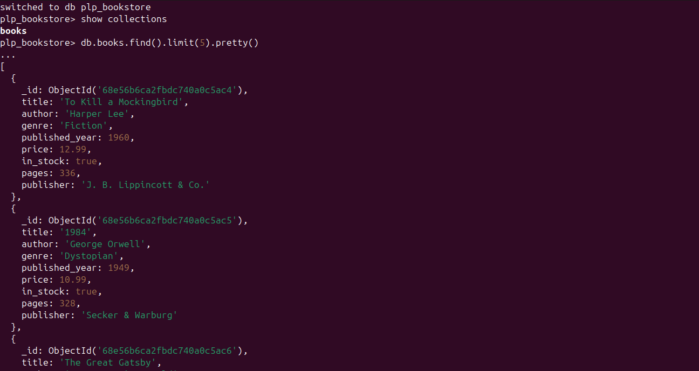
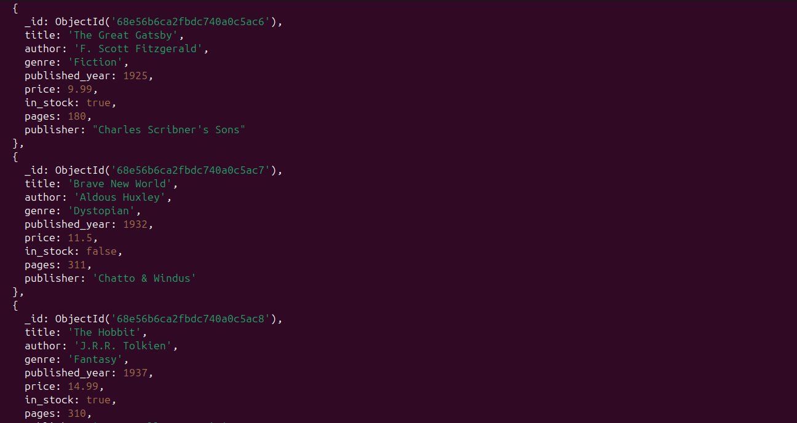

# 📚 PLP Bookstore – MongoDB Assignment

## 🗄️ Overview
This project demonstrates the use of MongoDB for managing a simple bookstore database.  
It covers MongoDB fundamentals such as CRUD operations, advanced queries, aggregation pipelines, and indexing.

---

## 🚀 Files Included
| File | Description |
|------|--------------|
| **insert_books.js** | Script to populate the `books` collection with sample data |
| **queries.js** | Contains all MongoDB queries for CRUD, filtering, sorting, aggregation, and indexing |
| **README.md** | Project documentation explaining setup and usage |

---

## 📸 Screenshots

### 1️⃣ Inserting Books into MongoDB
This shows the output after running `insert_books.js`:




---

## 🧰 Requirements
- Node.js (v18+ recommended)
- MongoDB (Local or Atlas)
- MongoDB Shell (`mongosh`) or MongoDB Compass (optional for GUI view)

---

## ⚙️ Setup Instructions

### 1️⃣ Install MongoDB (Local)
Run the following commands to install MongoDB Community Edition on Ubuntu:
```bash
sudo apt update
sudo apt install -y mongodb
sudo systemctl start mongodb
sudo systemctl enable mongodb
```

To confirm installation:
```bash
mongosh
```
If it opens the Mongo shell, MongoDB is installed successfully.

---

### 2️⃣ OR Use MongoDB Atlas (Cloud)
If you prefer cloud:
1. Go to [MongoDB Atlas](https://www.mongodb.com/cloud/atlas)
2. Create a free account and cluster
3. Copy your **connection string**
4. Replace this line in both JS files:
   ```js
   const uri = "mongodb://localhost:27017";
   ```
   with:
   ```js
   const uri = "your_atlas_connection_string";
   ```

---

## 🧩 Running the Scripts

### Step 1: Insert Sample Data
```bash
node insert_books.js
```

This creates a database called **`plp_bookstore`** and a collection called **`books`** with 10+ sample documents.

### Step 2: Run the Queries
```bash
node queries.js
```

This executes:
- CRUD operations  
- Advanced filtering and projection  
- Sorting and pagination  
- Aggregation pipelines  
- Index creation and performance analysis  

---

## 🧪 Sample Output
After running `insert_books.js` and `queries.js`, message like these will be seen:

```
Connected to MongoDB
12 books were successfully inserted
Fiction Books: [ ... ]
Average price by genre: [ ... ]
Connection closed
```

---

## 🧑‍💻 Author
**Name:** Abdurrahman Kabir  
**University:** Ahmadu Bello University, Zaria  
**Specialization:** MERN Stack (PLP Program)  
**GitHub:** [github.com/ABDURRAHMANKABEER](https://github.com/ABDURRAHMANKABEER)
